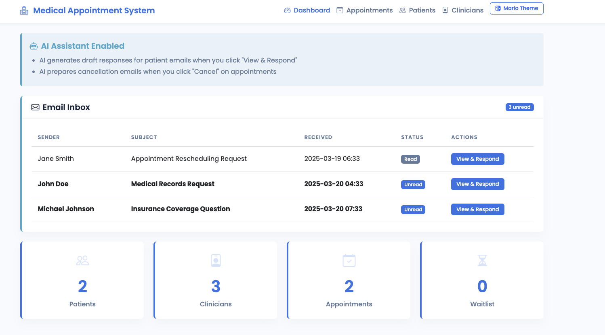

# AI Medical System

A Flask-based application that gives clinic managers their valuable time back by handling all the schedule-juggling that comes with patients canceling and rescheduling appointments.

## Overview

AI Medical System automates the tedious aspects of medical appointment management, using AI to generate patient communications and optimize scheduling. The system maintains a prioritized waitlist, handles cancellations, and ensures patients receive timely, empathetic responses.

## Quick Start

### Prerequisites

- Python 3.8+
- pip (Python package manager)
- Together AI API key (for AI-powered features)

### Installation

1. Clone the repository:
   ```
   git clone https://github.com/yourusername/secretari.git
   cd secretari
   ```

2. Install dependencies:
   ```
   pip install flask datetime enum dataclasses typing
   ```

3. Set up your Together AI API key:
   - Create a file named `api_keys.json` in the root directory
   - Add your API key in the following format:
     ```
     {"together":"your_api_key_here"}
     ```
   - You can obtain an API key by:
     - Asking Issam for access, or
     - Creating an account at [together.ai](https://together.ai) and generating a key

### Running the Application

1. Start the server:
   ```
   python main.py
   ```

2. Open your browser and navigate to:
   ```
   http://localhost:7776
   ```

## Features

The dashboard provides a complete view of your clinic's operations:



## AI-Powered Capabilities

AI Medical System uses AI to:
- Generate empathetic cancellation emails
- Draft responses to patient inquiries
- Optimize appointment scheduling based on patient priority and clinician availability
- Intelligently manage the waitlist to fill cancelled appointments

The AI assistant helps clinic staff save time while maintaining a personal touch in all patient communications.

## Data Handled

- **Patient Information**: Names, contact details, addresses, birthdays, family members, preferred clinicians
- **Scheduling Data**: Appointment dates, holidays, staff availability, office hours, patient availability

## Outputs

- Optimized appointment calendar with patients assigned to appropriate clinicians
- Prioritized waitlist for filling cancellations
- Communication notes between patients and clinic staff

## Technology

Built with Python and Flask, focusing on security, reliability, and ease of use for clinic staff.
